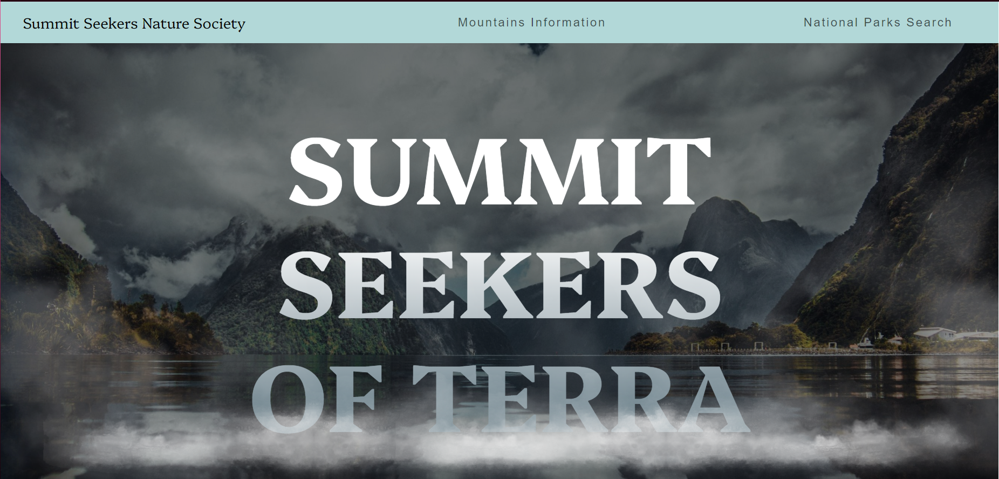
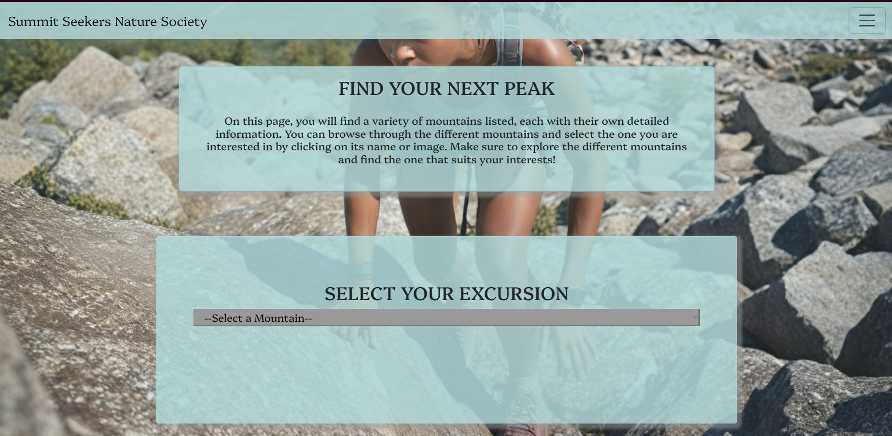
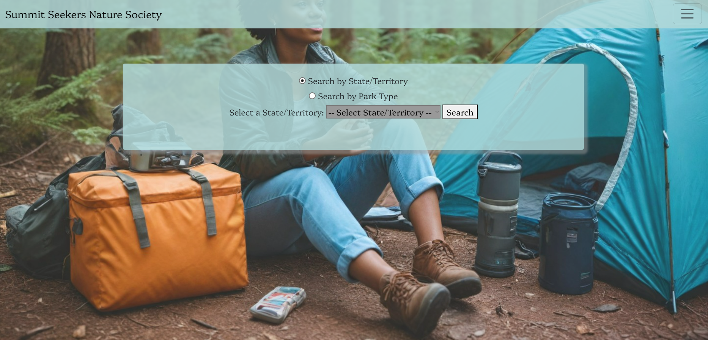

# EnjoyTheOutdoors
For this second Capstone, I created a website that focuses on outdoor adventures. The site features listings of national parks and mountains, providing essential information for visitors. Users can explore different mountains to climb and learn about the various national parks, including their key attractions and visitor tips. The goal is to help outdoor enthusiasts plan their trips and discover new destinations.

My home page offers animations on the buttons as well as a clean finish that draws in users. 

The Mountain Information page dynamically displays detailed data about various mountains using JavaScript, which fetches and populates the information from a predefined dataset.

The National Park page provides an overview of relevant parks, with JavaScript fetching and displaying the information, and includes a "Back to the Top" button for easy navigation.

The Full Mountain Information Directory is a static HTML page that lists mountain details directly in the markup, featuring a "Back to the Top" button for user convenience
